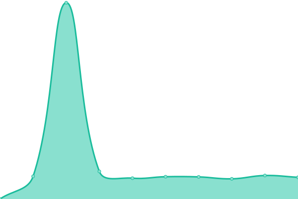

# [📈 Live Status](https://uptime.now.cc): <!--live status--> **🟧 Partial outage**

This repository contains the open-source uptime monitor and status page for [cdxii](justmojito.com), powered by [Upptime](https://github.com/upptime/upptime).

With [Upptime](https://upptime.js.org), you can get your own unlimited and free uptime monitor and status page, powered entirely by a GitHub repository. We use [Issues](https://github.com/pachakutiq199999/upptime/issues) as incident reports, [Actions](https://github.com/pachakutiq199999/upptime/actions) as uptime monitors, and [Pages](https://uptime.now.cc) for the status page.

<!--start: status pages-->
<!-- This summary is generated by Upptime (https://github.com/upptime/upptime) -->
<!-- Do not edit this manually, your changes will be overwritten -->
<!-- prettier-ignore -->
| URL | Status | History | Response Time | Uptime |
| --- | ------ | ------- | ------------- | ------ |
|  [Justmojito.com](https://justmojito.com) | 🟥 Down | [justmojito-com.yml](https://github.com/pachakutiq199999/upptime/commits/HEAD/history/justmojito-com.yml) | 

 521ms
     
 | 

<a href="https://uptime.now.cc/history/justmojito-com">83.27%</a>
    

|  [Justmojito.xyz](https://justmojito.xyz) | 🟥 Down | [justmojito-xyz.yml](https://github.com/pachakutiq199999/upptime/commits/HEAD/history/justmojito-xyz.yml) | 

 622ms
     
 | 

<a href="https://uptime.now.cc/history/justmojito-xyz">83.90%</a>
    

|  [Mojito EU](https://mojito.eu.org) | 🟩 Up | [mojito-eu.yml](https://github.com/pachakutiq199999/upptime/commits/HEAD/history/mojito-eu.yml) | 

 1159ms
     
 | 

<a href="https://uptime.now.cc/history/mojito-eu">88.14%</a>
    

|  [Mail](https://mail.justmojito.com) | 🟥 Down | [mail.yml](https://github.com/pachakutiq199999/upptime/commits/HEAD/history/mail.yml) | 

 1796ms
     
 | 

<a href="https://uptime.now.cc/history/mail">98.81%</a>
    

|  [RSS](https://rss.orgs.hk) | 🟥 Down | [rss.yml](https://github.com/pachakutiq199999/upptime/commits/HEAD/history/rss.yml) | 

 581ms
     
 | 

<a href="https://uptime.now.cc/history/rss">88.86%</a>
    

<!--end: status pages-->

[**Visit our status website →**](https://uptime.now.cc)

## 📄 License

- Powered by: [Upptime](https://github.com/upptime/upptime)
- Code: [MIT](./LICENSE) © [cdxii](justmojito.com)
- Data in the `./history` directory: [Open Database License](https://opendatacommons.org/licenses/odbl/1-0/)
